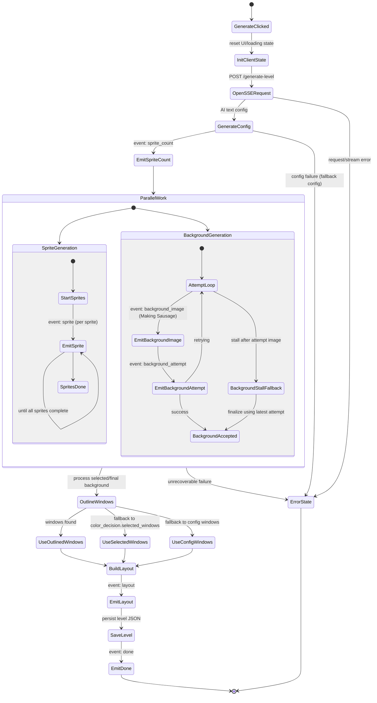

# Level Generation State Diagram

This document describes the high-level flow that starts after clicking **Generate Level**.

## State Diagram



## What You See In The UI

1. Client initialization
- Clears prior level state.
- Starts loading phase and timeout countdown.

2. Early stream events
- `sprite_count` arrives first so placeholders can render.
- `sprite` events arrive as each sprite completes.

3. Background retries (Making Sausage)
- Each attempt can emit:
  - `background_image`: preview image for that attempt.
  - `background_attempt`: attempt number and status (`retrying`/`success`).
- If backend validation stalls after an attempt image is already available, the server finalizes from the latest attempt instead of hanging indefinitely.

4. Window selection cascade
- Preferred: outlined windows from final background processing.
- Fallback 1: `color_decision.selected_windows`.
- Fallback 2: config windows.

5. Finalization
- `layout` emitted with background URLs, windows, and metadata.
- Level is saved.
- `done` emitted.

## Notes

- In Making Sausage mode, background images are surfaced as soon as each attempt returns.
- The UI timeout is a countdown indicator, not a hard cancellation of the backend request.
- A level can still be saved/reviewed when sprites and a background attempt image exist, even if strict validation did not fully complete.

## Sequence Diagram

```mermaid
sequenceDiagram
    autonumber
    participant U as User
    participant C as Client (React)
    participant B as Backend (/generate-level SSE)
    participant G as Gemini APIs
    participant W as Window Outliner
    participant S as Storage (JSON)

    U->>C: Click Generate Level
    C->>B: POST /generate-level (SSE)

    B->>G: generate_level_config(theme)
    G-->>B: config (title, monster descriptions, hints)
    B-->>C: event sprite_count

    par Sprite generation (concurrent)
        loop per sprite
            B->>G: generate_sprite(description)
            G-->>B: sprite image
            B-->>C: event sprite(index, url)
        end
    and Background generation (concurrent)
        loop attempt 1..N
            B->>G: generate background image
            G-->>B: attempt image
            opt Making Sausage mode
                B-->>C: event background_image (attempt preview)
            end
            B-->>C: event background_attempt(status)

            B->>G: occupied-window / key-color checks
            G-->>B: validation signals
            alt valid
                break accept image
            else retry
                note over B: continue to next attempt
            end
        end

        alt stalls after attempt image
            note over B: finalize from latest attempt image
        end
    end

    B->>W: outline_windows_from_image(background, selected key color)
    W-->>B: windows + processed background + overlay

    alt no outlined windows
        B->>B: fallback to color_decision.selected_windows
    end
    alt still none
        B->>B: fallback to config windows
    end

    B-->>C: event layout (backgrounds, windows, metadata)
    B->>S: save_level(level JSON)
    S-->>B: saved
    B-->>C: event done

    C-->>U: Render playable/reviewable level
```
